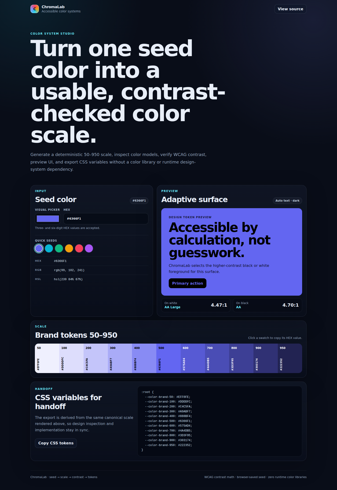

# ChromaLab — Color Scale & Contrast Studio

**Start with one brand color. Leave with a usable scale, measured contrast, and CSS tokens.**

[**Open ChromaLab →**](https://mykoladotsenko.github.io/chromalab/)\n\n[](https://github.com/MykolaDotsenko/chromalab/actions/workflows/quality.yml)



A common frontend task starts with something deceptively small:

> “Our brand color is `#6366F1`. Can you turn it into a usable UI palette?”

One color is not enough for a real interface. You usually need lighter surfaces, stronger states, readable text, predictable tokens, and a quick way to verify contrast before those values spread through the codebase.

ChromaLab keeps that workflow in one small browser tool.

```text
seed color
   ↓
50–950 scale
   ↓
HEX / RGB / HSL
   ↓
contrast against black + white
   ↓
foreground recommendation
   ↓
CSS custom properties
```

## From brand color to implementation

Enter a HEX value or use the native color picker.

For a seed such as:

```text
#6366F1
```

ChromaLab generates a deterministic **50–950 scale** around it and keeps the seed at the 500 step.

Each swatch can be copied directly. The same scale can be exported as CSS variables, so the values being inspected are the values handed to the implementation.

That makes the tool useful for small jobs such as:

- exploring a new brand/accent color;
- preparing a token scale for a component or prototype;
- checking whether dark or light foreground text is safer;
- copying a specific shade into DevTools;
- handing a small palette from design exploration into CSS.

## Contrast is measured, not eyeballed

For the current seed, ChromaLab calculates WCAG relative luminance and contrast against both white and black.

```text
(Llighter + 0.05) / (Ldarker + 0.05)
```

The studio shows the ratio and AA / AAA grade, then recommends whichever of black or white has the higher measured contrast on the selected surface.

The preview therefore answers a practical question immediately:

> “If this becomes a button or panel background, should the text be light or dark?”

The recommendation is intentionally narrow. It is a black/white foreground decision, not a claim that one contrast check proves an entire interface accessible.

## The scale is predictable

Palette generation lives in a pure color module rather than inside React components.

```text
normalize seed
      ↓
describe RGB / HSL
      ↓
mix deterministic tints + shades
      ↓
calculate contrast
      ↓
serialize CSS tokens
```

The current scale uses deterministic **sRGB mixing**.

That gives stable, testable output. It does not claim perceptually uniform lightness steps; if perceptual uniformity became a product requirement, OKLCH would be the more appropriate model.

## The exported tokens come from the same source

ChromaLab does not maintain a separate “pretty preview palette” and “implementation palette”.

The rendered swatches and exported custom properties are derived from the same canonical scale.

Example shape:

```css
:root {
  --color-brand-50:  ...;
  --color-brand-100: ...;
  --color-brand-200: ...;
  /* ... */
  --color-brand-500: #6366F1;
  /* ... */
  --color-brand-950: ...;
}
```

That removes a small but common handoff problem: copying values manually from an exploratory tool into production CSS and introducing a mismatch.

## Small browser details still matter

The seed color is saved locally, so reopening the tool restores the last valid selection.

Invalid persisted data fails closed to the default seed instead of becoming application state.

The studio also includes:

- editable 3- and 6-digit HEX input;
- native visual color picker;
- HEX / RGB / HSL inspection;
- copyable scale swatches;
- live foreground preview;
- Clipboard API feedback;
- visible validation states;
- reduced-motion support;
- forced-colors fallback;
- keyboard-accessible native controls.

## Under the UI

```text
React presentation
        │
        ▼
pure color domain
├── HEX normalization
├── RGB / HSL conversion
├── deterministic scale
├── luminance / contrast
├── foreground selection
└── CSS serialization

browser storage
        │
        └── validated seed only
```

The color domain has no React, DOM, storage, or clipboard dependency.

Runtime dependencies are only React and React DOM.

## Stack

- React 19
- Vite 8
- JavaScript / ES modules
- Web Storage
- Clipboard API
- Node built-in test runner
- Playwright
- axe-core
- ESLint
- GitHub Actions

Tests cover HEX normalization, RGB round trips, deterministic mixing, the stable 500 seed, WCAG contrast math, foreground selection, CSS serialization, corrupt persistence, browser persistence, invalid-input recovery, accessibility, and desktop/mobile overflow.

## Run locally

Requires Node.js 22.22+.

```bash
git clone https://github.com/MykolaDotsenko/chromalab.git
cd chromalab
npm ci
npm run dev
```

Verification:

```bash
npm run check
npx playwright install chromium
npm run test:e2e
```

## Code map

- [`src/domain/color.js`](./src/domain/color.js) — color math and token serialization
- [`src/components/ColorPickerApp.jsx`](./src/components/ColorPickerApp.jsx) — studio UI
- [`src/storage/colorStorage.js`](./src/storage/colorStorage.js) — saved-seed boundary
- [`tests/color.test.js`](./tests/color.test.js) — domain regression tests
- [`e2e/chromalab.spec.js`](./e2e/chromalab.spec.js) — browser and accessibility checks
- [`ARCHITECTURE.md`](./ARCHITECTURE.md) — deeper implementation notes

ChromaLab started as a much smaller React color-picker exercise. The repository keeps that history in Git while the current product surface focuses on the useful workflow above.
